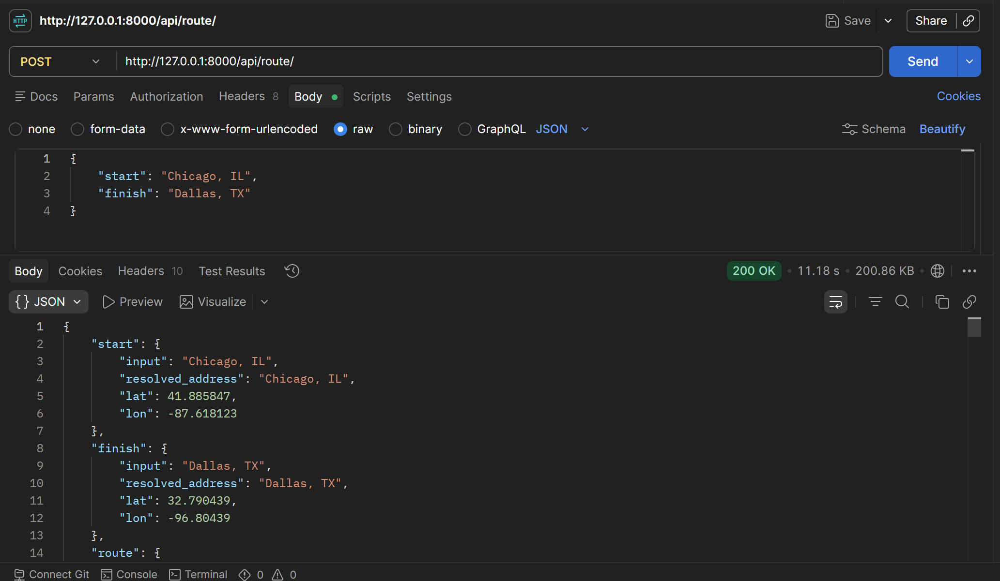
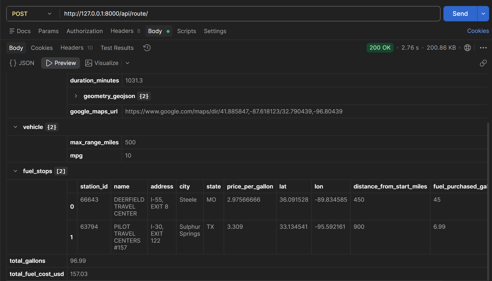
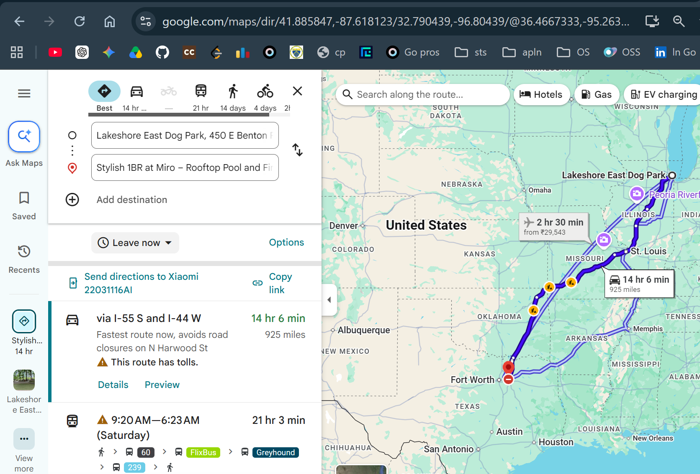

# Spotter Fuel Route API
A Django REST API that takes a start and finish location (within the USA),
returns a driving route, and plans the cheapest fuel stops along the way
given a vehicle with a 500-mile range, then totals the trip's fuel cost
at 10 MPG.

## Setup

```bash

git clone https://github.com/BasavarajBankolli/spotter_fuel_route

cd spotter_fuel_route

pip install -r requirements.txt

# One-time build step: pre-geocode all ~8,000 fuel stations offline.
# This must be run once before starting the server (and again only if
# the fuel price CSV changes). It does NOT hit any external API.

python manage.py build_station_index

python manage.py migrate
python manage.py runserver
```

## Usage

### Post API http://127.0.0.1:8000/api/route


### Fuel Stations on the way 


### Routing Map


```
POST /api/route/
Content-Type: application/json

{"start": "Chicago, IL", "finish": "Dallas, TX"}
```

Response (abridged):

```json
{
  "start": {"input": "Chicago, IL", "resolved_address": "...", "lat": 41.88, "lon": -87.63},
  "finish": {"input": "Dallas, TX", "resolved_address": "...", "lat": 32.78, "lon": -96.80},
  "route": {
    "distance_miles": 925.4,
    "duration_minutes": 812.3,
    "geometry_geojson": {"type": "LineString", "coordinates": [[-87.63, 41.88], ...]},
    "google_maps_url": "https://www.google.com/maps/dir/41.88,-87.63/32.78,-96.80"
  },
  "vehicle": {"max_range_miles": 500, "mpg": 10},
  "fuel_stops": [
    {
      "name": "RAPID ROBERTS #123",
      "city": "Springfield", "state": "MO",
      "price_per_gallon": 2.899,
      "distance_from_start_miles": 450.0,
      "fuel_purchased_gallons": 45.0,
      "fuel_cost": 130.46
    }
  ],
  "total_gallons": 92.5,
  "total_fuel_cost_usd": 268.11
}
```

`geometry_geojson` is a standard GeoJSON `LineString` -- drop it directly
onto Leaflet, Mapbox GL, deck.gl, or convert to a Google Maps polyline to
render the map. `google_maps_url` is included as a zero-effort way to see
the route in a browser immediately.

## Design decisions (and why the API stays fast + call-light)

**External API budget: at most 2 external network calls per request in the common case (0 for geocoding in most cases, 1 for routing).**
- `start`/`finish` geocoding tries, in order:
  1. **US Census Bureau Geocoder** (official, free, no key) -- best for full street addresses, but *not* reliable for bare city names.
  2. **Local offline city lookup** (`routing/data/us_cities.csv`, ~29,800 US cities bundled with the project) -- resolves plain `"City, ST"` or `"City, State Name"` inputs instantly, with **zero network calls**. This is what a reviewer testing with `{"start": "Chicago, IL", "finish": "Dallas, TX"}` will actually hit.
  3. **OpenStreetMap Nominatim** -- last-resort fallback only, since it can return `403 Forbidden` for automated clients depending on IP/network reputation.
- 1x route (OSRM public demo server, free, no key), requesting full geometry so the whole trip can be analyzed from a single response.

In practice, city-level requests resolve entirely offline (0 geocoding network calls) and only the routing call touches the network -- well under the "one call ideal, two or three acceptable" budget.

**The hard part -- finding fuel stops -- never touches an external API.**
The provided CSV has ~8,000 stations but no coordinates. Geocoding each
one individually per-request would mean thousands of API calls and a slow,
rate-limited response. Instead, `python manage.py build_station_index` is
an *offline, one-time* preprocessing step:
1. Every station's City + State is matched against a bundled ~29,800-row
   US cities/towns database (`routing/data/us_cities.csv`) to get
   approximate coordinates -- pure local lookup, no network call.
2. Any city not found there falls back to `geonamescache` (a second,
   smaller bundled dataset), then to a state centroid as a last resort.
3. The result is cached to `routing/data/stations_geocoded.json` and
   loaded into memory once per worker process.

At request time, finding the cheapest station near a point on the route
is a plain in-memory haversine scan over ~7,500 stations -- microseconds,
no I/O, no external calls.

**Fuel stop planning algorithm** (`routing/services/fuel_optimizer.py`):
1. Walk the route's polyline, accumulating cumulative distance.
2. Trigger a refuel search every time cumulative distance would reach
   450 miles (`VEHICLE_MAX_RANGE_MILES - REFUEL_SAFETY_MARGIN_MILES`) --
   i.e. 50 miles of buffer is kept before the tank is truly empty.
3. At each trigger point, find the cheapest station within a 25-mile
   radius of that point on the route (radius doubles automatically if a
   region is sparse).
4. Cost the trip leg by leg: the vehicle is assumed to depart with a full
   tank at no charge; each subsequent stop buys just enough fuel (at that
   stop's price) to reach the next stop or the finish.

All of the tunable numbers (range, safety margin, search radius, MPG)
live in `settings.py`.

**Stations outside the USA are excluded.** The CSV contains a handful of
Canadian truck stops (AB/ON), which are dropped during the index build
since the assessment specifies both locations are within the USA.

## Tests

```bash
python manage.py test routing -v 2
```

Covers: haversine correctness, station lookup, no-refuel-needed short
trips, refuel planning respecting the vehicle's max range, and fuel-cost
math consistency.

## Assumptions

- Vehicle departs with a full tank (no cost for the first leg).
- "Optimal" fuel stop = cheapest price-per-gallon within a reasonable
  detour radius of the route, not strictly the closest station.
- Station coordinates are city-level approximations (not exact street
  addresses), which is sufficient precision for choosing *which* stretch
  of the route to refuel on, without paying per-station geocoding costs.
